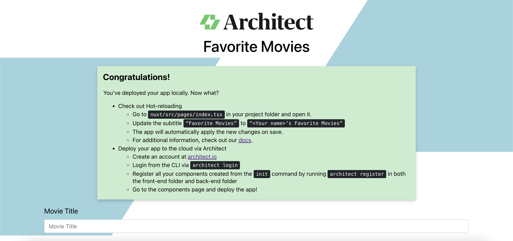

<p align="center">
  <a href="//architect.io" target="blank"></a>
</p>

<p align="center">
  A dynamic microservices framework for building, connecting, and deploying cloud-native applications.
</p>

---

# Nuxt.js TSX starter project

I love Nuxt and Vue for heavy web applications, but have recently grown to favor React in large part due to JSX. I wanted to setup a way for me to get the SSR support I love from Nuxt while writing templates using JSX, and found that can be done through a combination of [first class support from Vue](https://vuejs.org/v2/guide/render-function.html#JSX) and [some clever babel presents](https://github.com/vuejs/jsx)! The usage of JSX allows me to further benefit from Typescript and type checking inside my template logic to let me develop faster and make better use of my IDE.

I've put together this project to help myself and others setup new web application projects easily. Enjoy!



## Getting started

### Clone and install dependencies

```sh
git clone https://github.com/architect-team/template-nuxt-tsx.git
npm install
```

### Run with Architect

I like to debug in more production-ready environments to ensure that my projects can be promoted to production more quickly. To accomplish this, I use [Architect](https://docs.architect.io/), which allows me to start my application with the following command:

```sh
$ architect dev architect.yml
```

Unlike the prior steps, this deploy generates an API gateway even for testing, and the application will be available at `http://app.arc.localhost`.

## Larger projects

Want to see a larger project using this same boilerplate? Check out the following:

- [Architect Auth](https://github.com/architect-team/architect-auth) - A self-hosted user authentication and authorization server.
